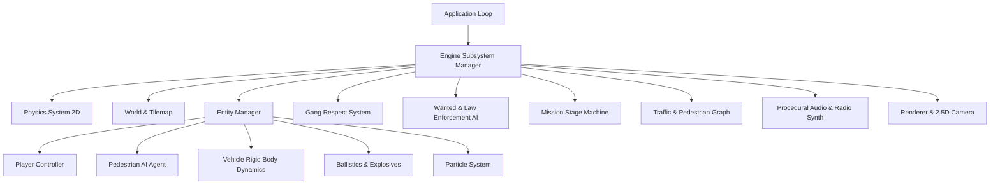

# GTA 2: City of Chaos - Architecture & Technical Specification

## Overview

GTA 2: City of Chaos is designed with modern C++20 principles, emphasizing high runtime performance, deterministic simulations, clean decoupling, and modern data-oriented techniques.

---

## 1. Engine Core & Subsystems

### `core::Application`
The heartbeat of the game. Manages:
- Fixed timestep physics updates (`dt = 1/60s`) with accumulator interpolation.
- Variable timestep rendering.
- State transitions (`State::TitleMenu`, `State::InGame`, `State::MissionBriefing`, `State::GameOver`, `State::Busted`).
- Headless execution mode for CI testing.

### `core::Math` & `core::Random`
- Fast 2D vector mathematics (`Vec2`), bounding box collision testing (`Rect2D`), raycasting, angle normalization, and cross/dot products.
- Deterministic XORShift128+ pseudo-random number generator for reproducible traffic, weather, and mission scenarios.

---

## 2. World & Map Representation

### `world::CityMap`
- **Tile-based grid structure** divided into distinct districts (Downtown, Industrial, Residential).
- Each tile contains properties:
  - `TileType`: Road, Sidewalk, Grass, Water, Concrete, Building Wall, Stunt Ramp, Hazard.
  - `friction`: Modifies tire grip and pedestrian walk speed.
  - `isCollidable`: Blocks movement and projectile trajectories.
  - `height`: Supports multi-tier bridges, overhead walkways, and ramp jumps.

### `world::RoadGraph`
- Direct acyclic lane graphs modeling real city flow:
  - Nodes: Intersections, crossings, entry/exit points.
  - Edges: Directed one-way / two-way road lanes, speed limits, right-of-way priorities.
  - Traffic Light controllers cycling between Green, Yellow, Red with crosswalk synchronization.

---

## 3. Vehicle Physics Model

Top-down vehicle simulation uses a dedicated **arcade 2D rigid-body model**:
- **Forward/Reverse Traction**: Acceleration governed by motor torque curves, transmission gear ratios, and maximum speed.
- **Steering & Angular Velocity**: Ackerman steering geometry approximation with speed-sensitive turning radii.
- **Lateral Grip & Drift Slip Angle**: Dynamic friction model calculating lateral tire velocity:
  $$\vec{F}_{\text{lateral}} = -\text{clamp}(\vec{v}_{\text{lat}}, -\mu_{\text{max}}, \mu_{\text{max}}) \cdot \text{gripFactor}$$
  When handbrake is engaged, rear tire grip drops by 75%, initiating controllable power slides.
- **Collision Impulses**: Elastic and inelastic collision resolution with walls, pedestrians, and other vehicles, applying damage and angular spin.
- **Vehicle Weapons**: Front-mounted machine guns, rear oil-slick dispensers, and chassis car-bombs.

---

## 4. Gang Respect System

GTA 2's signature mechanic is fully implemented via `systems::GangSystem`:
- 3 active syndicates: **The Zaibatsu Corporation**, **The Loonies**, and **The Yakuza**.
- Each syndicate maintains a Respect Meter between `-100` (Shoot on sight / Hit squads dispatched) and `+100` (Allied / Armed escorts provided).
- **Respect Cross-Coupling**:
  $$\Delta R_{\text{Zaibatsu}} = +10 \implies \Delta R_{\text{Loonies}} = -5, \quad \Delta R_{\text{Yakuza}} = -5$$
- **Color-Coded Payphones**:
  - 🟢 **Green Phone**: Requires `Respect >= -20`. Simple courier, extortion, or hitman jobs.
  - 🟡 **Yellow Phone**: Requires `Respect >= +25`. Tactical assaults, armored heists, sabotage.
  - 🔴 **Red Phone**: Requires `Respect >= +60`. High-intensity syndicate wars and boss assassinations.

---

## 5. Law Enforcement & 6-Star Wanted System

The police AI operates under a multi-tier threat escalation pipeline:
1. **⭐ 1 Star**: 1-2 Foot patrol officers pursue with batons and standard sidearms.
2. **⭐⭐ 2 Stars**: Police cruisers patrol high-speed, attempt to ram player vehicle, and set up dynamic roadblocks.
3. **⭐⭐⭐ 3 Stars**: SWAT tactical vans deploy with spike strips that pop tires.
4. **⭐⭐⭐⭐ 4 Stars**: Tactical assault officers armed with M16 rifles and body armor.
5. **⭐⭐⭐⭐⭐ 5 Stars**: Special Agent interceptors (fast black sedans) engaging in drive-by shootings.
6. **⭐⭐⭐⭐⭐⭐ 6 Stars**: National Guard APCs and heavy Tanks with explosive cannons patrolling streets.

**Pay 'N' Spray Respray Garages**: Driving into a spray shop when not directly in line-of-sight repaints the car and wipes wanted stars for a fee.

---

## 6. Procedural Audio & In-Car Radio

- **Zero Asset Lock-in**: Real-time sound wave synthesizer generating sine, square, saw, and noise waveforms for:
  - Engine revving (frequency modulated saw waves)
  - Tire screeching (bandpass filtered white noise)
  - Gunshots & Explosions (steep decay noise with low-pass resonance)
  - Police & Emergency Sirens (frequency sweep dual-tone modulation)
- **Radio Engine**: 6 distinct procedural station loops with basslines, drum beats, and jingles.
